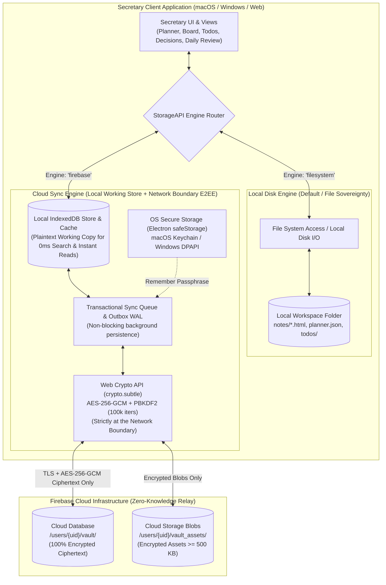
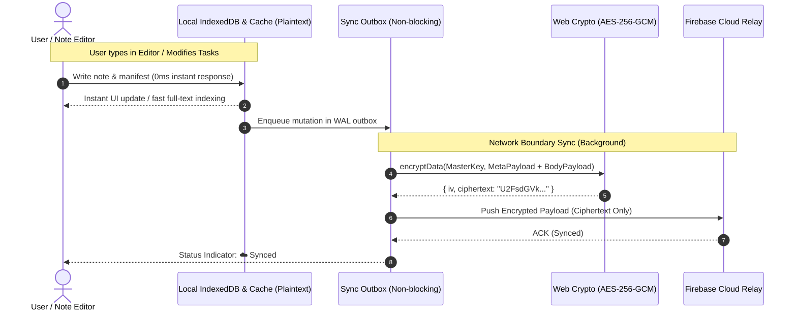
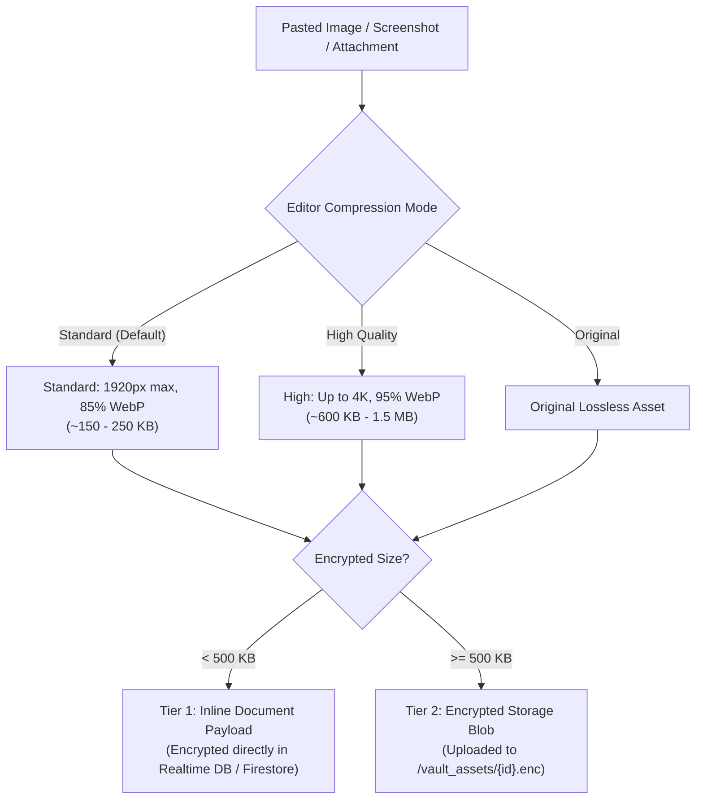

# Secretary 📝👥📅

**Secretary** is a private, local-first personal note manager, task organizer, and AI-assisted companion designed to run seamlessly as a **native desktop application** (macOS, Windows) or directly in Chromium web browsers.

With **Secretary v4.0.0**, you get the best of both worlds: complete **local disk sovereignty** using standard files and an optional, high-performance **End-to-End Encrypted (E2EE) Zero-Knowledge Firebase Cloud Sync** for seamless real-time synchronization across multiple computers.

---

## ⬇️ Download

| Platform | Architecture | Download |
|---|---|---|
| 🍎 **macOS** | Apple Silicon (M1/M2/M3/M4) | [**Secretary-4.0.9-arm64.dmg**](https://github.com/ebelt9hf/The_Secretary/releases/download/v4.0.9/Secretary-4.0.9-arm64.dmg) · [.zip](https://github.com/ebelt9hf/The_Secretary/releases/download/v4.0.9/Secretary-4.0.9-arm64-mac.zip) |
| 🪟 **Windows** | Portable Package (x64 / ARM64) | [**Secretary-4.0.9-win.zip**](https://github.com/ebelt9hf/The_Secretary/releases/download/v4.0.9/Secretary-4.0.9-win.zip) |

> **macOS**: Open the `.dmg`, drag **Secretary.app** to Applications. On first launch, right-click → **Open** to bypass Gatekeeper (app is unsigned).  
> **Windows**: Extract the `.zip` and run `Secretary.exe`. No installation needed.

All releases: [github.com/ebelt9hf/The_Secretary/releases](https://github.com/ebelt9hf/The_Secretary/releases)

---

## 🔒 Dual-Engine Storage & Zero-Knowledge Privacy Architecture

Secretary features a **Dual-Engine Storage Architecture** managed by an intelligent abstraction layer (`StorageAPI`). You can work completely offline with a local folder on your hard drive, or enable high-performance E2EE Cloud Sync with zero risk to your privacy.



---

### 🛡️ How Private Is Your Data? (Zero-Knowledge Guarantee)

Secretary's cloud sync is built from the ground up on the principle of **Zero-Knowledge End-to-End Encryption (E2EE)**:

1. **Plaintext Local Working Store (0ms Latency & Instant Search)**:
   - Working notes and indexes are stored in local browser IndexedDB and memory cache in clean plaintext, allowing **sub-millisecond note opens, instant switching, and lightning-fast full-text searches** with 0ms crypto overhead during local typing and editing.

2. **Network-Boundary Encryption (Zero Plaintext in the Cloud)**:
   - **Encryption and decryption occur strictly at the network boundary**.
   - Outbound writes to Firebase Cloud are encrypted with **AES-256-GCM** immediately before transmission.
   - Inbound updates from the cloud are decrypted locally before updating the local IndexedDB working store.
   - Firebase only ever receives and stores base64-encoded ciphertext blobs: third parties, relays, or unauthorized parties **cannot read note titles, content, tags, dates, colleague info, or attachments**.

3. **Client-Side Key Derivation (PBKDF2-HMAC-SHA-256)**:
   - Your master passphrase is **never transmitted across the network** and **never stored in the cloud**.
   - A 256-bit encryption key is derived entirely on your device using **PBKDF2 with HMAC-SHA-256** and **100,000 iterations** combined with a cryptographically secure 128-bit random salt.

4. **Exit Confirmation & Ephemeral Session Purge (Shared/Work PCs)**:
   - When closing Secretary in Cloud Mode, users are presented with an exit confirmation dialog:
     - **`[ Close ]`**: Synchronizes pending changes and closes while keeping the fast local IndexedDB cache on private computers for instant startup.
     - **`[ Close & Delete Local Copies ]`**: Flushes all writes to Firebase, completely wipes local IndexedDB stores and memory caches, and locks the vault. Zero traces left on shared or work computers.
     - **`[ Cancel ]`**: Cancels and returns to the application.

5. **Zero-Knowledge Canary Token Verification**:
   - To verify passphrases on new devices without storing plaintext credentials, Secretary uses a randomized canary payload (`secretary-vault-verified-v4`).
   - The client verifies password validity purely through local decryption of the canary token.

6. **OS-Backed Secure Passphrase Storage**:
   - On Desktop (Electron), you can securely save your passphrase using native OS hardware-backed encryption (`safeStorage` backed by Apple Keychain on macOS and DPAPI on Windows).

7. **Encrypted Settings Sync & AI API Key Isolation**:
   - Workspace settings (theme, custom HSL color palette, working days/hours, language, and username) are encrypted and synchronized across all your devices.
   - **Sensitive AI API keys (`ai.apiKey`), local LLM tokens, vault passphrase tokens, and hardware window coordinates are strictly excluded from cloud synchronization** and remain stored purely on your local machine.

8. **Passphrase Rotation & Re-Encryption**:
   - Easily rotate your master passphrase at any time with one click. Secretary re-encrypts all local and cloud vault records in the background without data loss.

9. **No Vendor Lock-In**:
   - You can export your entire encrypted cloud vault back to standard `.html` files and JSON manifests on your local disk at any time.

---

### 🔄 Data Synchronization & Cryptographic Lifecycle



---

### 🖼️ 2-Tier Storage & Client-Side Image Optimizer

To keep cloud storage lightning fast and prevent payload bloat, Secretary uses an intelligent **2-tier asset routing pipeline**:



---

## ✨ Key Features

- 🔒 **Dual-Engine Storage**: Choose between 100% transparent local folder storage or zero-knowledge E2EE Firebase Cloud Sync.
- ⚙️ **Encrypted Settings Sync with AI Key Isolation**: Sync themes, custom palettes, schedules, and profile across devices while keeping AI API keys strictly local.
- ⚡ **Background Web Worker**: Cryptographic operations and sync runs in a dedicated Web Worker (`app-sync-worker.js`), ensuring buttery-smooth 60 FPS UI performance.
- 🌐 **Multi-Tab & Cross-Window Sync**: Instant broadcast updates across multiple open tabs and windows using `BroadcastChannel`.
- 📝 **WYSIWYG Rich Text Editor**: Clean HTML editor with real-time markdown shortcuts, checklist toggles, image paste with in-editor quality toggles, and LaTeX math formula rendering.
- 📅 **Weekly Time-Blocking Planner**: Interactive calendar with drag-to-create scheduling, recurring series, ICS file import/export, and integration with AI-suggested events (`planner-proposals.json`).
- 📊 **Kanban Tasks & Eisenhower Scatterplot**: Actionable task management with Kanban columns, delegation tracking, and an interactive Eisenhower Matrix ("tods") for Urgency vs. Importance prioritization.
- 👥 **Teams & Decisions**: Strategic registry for tracking 1:1 check-ins, meeting notes, colleague management chains, and timestamped decision histories with superseding support.
- 🌅 **Daily Review Wizard**: Guided evening reflection workflow to process stashed quick notes, clear action items, review meetings, and organize tomorrow's priorities.
- 🔄 **Weekly Retrospective**: High-level retrospective summarizing completed goals, highlights, workstream progress, and carryover debt with instant export.
- 🤖 **Local AI Copilot & Tool Calls**: Connect to local LLMs (Ollama, LM Studio) or cloud providers with automated RAG context retrieval, note diff suggestions, and structured tool executions.
- 🌍 **15 European Languages**: 100% localized interface supporting English (`en`), Deutsch (`de`), Français (`fr`), Čeština (`cs`), Español (`es`), Magyar (`hu`), Italiano (`it`), Nederlands (`nl`), Polski (`pl`), Português (`pt`), Română (`ro`), Русский (`ru`), Svenska (`sv`), Türkçe (`tr`), and Українська (`uk`).

---

## 🚀 Installation & Running Locally

Secretary can be run as a **native desktop application** (Electron) or served in any modern Chromium browser (Google Chrome, Microsoft Edge, Brave).

### Option 1: Native Desktop Application (Recommended)

1. **Install Dependencies**:
   ```bash
   npm install
   ```

2. **Launch Application in Development Mode**:
   ```bash
   npm run dev
   ```

3. **Package Native Installers**:
   ```bash
   # Build macOS App (.app / .dmg)
   npm run package:mac   # Creates dist/mac-arm64/Secretary.app
   npm run dist:mac      # Builds distributable macOS installer (.dmg)

   # Build Windows Executables (.exe / Portable)
   npm run package:win   # Creates dist/win-unpacked/Secretary.exe
   npm run dist:win      # Builds standalone Windows installer & portable .exe (x64 / ARM64)
   ```

---

### Option 2: Browser Mode

1. **Build Distribution Bundle**:
   ```bash
   npm run build
   ```

2. **Start Local Static Server**:
   ```bash
   npx serve dist -l 8000
   ```
3. Open [http://localhost:8000/app.html](http://localhost:8000/app.html) in Google Chrome or Microsoft Edge.

---

## 📂 Storage & Workspace Structure

When operating in **Local Disk Mode**, Secretary stores all data in human-readable files inside your selected directory:

```text
my-secretary-workspace/
├── notes_summary.json       # Fast-loading manifest index of all notes
├── notes/                   # Plain .html note files with embedded metadata headers
│   ├── 2026-10-06_kickoff.html
│   └── architecture_notes.html
├── todos/                   # Active tasks and Kanban column manifests
│   └── todos_manifest.json
├── planner.json             # Calendar blocks, recurring series, and schedules
├── planner-proposals.json   # Calendar blocks proposed by external AI agents
├── colleagues.json          # Teammate directory, manager chains, and roles
└── secretary-settings.json  # Theme preferences, language, and AI configurations
```

When operating in **E2EE Firebase Vault Mode**, the same structural schema is encrypted with **AES-256-GCM** client-side and mirrored in your persistent local IndexedDB (`SecretaryFirebaseVaultDB`) and encrypted cloud relay. Non-credential workspace settings (theme, custom colors, work hours, language) are encrypted and synced to the cloud vault, while sensitive AI API keys and hardware window parameters remain stored strictly on your local machine in `secretary-settings.json`.

---

## 🧪 Testing & Verification

Secretary includes automated unit tests covering cryptographic routines, sync workers, storage adapters, planner algorithms, and UI components:

```bash
# Validate translation parity across all 15 languages
python3 development/check_translations.py

# Run Vitest unit test suite (1,100+ tests)
npm test

# Build production bundle
npm run build
```

---

## ❓ Troubleshooting

- **"API access blocked" or "Browser Not Supported"**:
  Ensure you are using a Chromium-based browser (Chrome, Edge, Brave). Apple Safari and Mozilla Firefox do not yet support the File System Access API required for local disk mode.
- **Lost folder selection on reload**:
  Chromium browsers require folder re-authorization upon restarting for security. Click the **↩ Resume last folder** button on the start screen to quickly re-authorize.
- **Forgot Cloud Sync Master Passphrase**:
  Because Secretary uses zero-knowledge encryption, your passphrase cannot be recovered or reset by anyone if lost. Always back up your master passphrase in a secure password manager.
