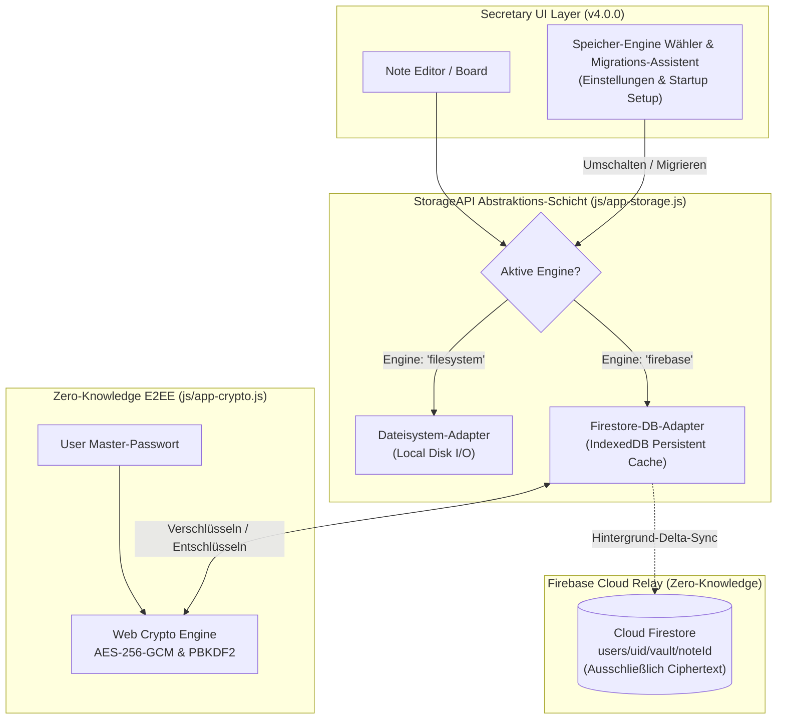
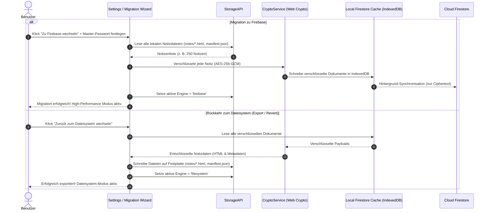
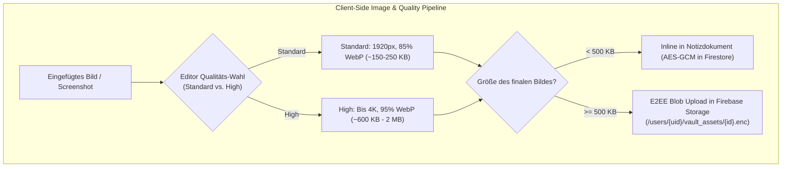

# Architekturplan: End-to-End verschlüsselte Firebase Synchronisation (Secretary v4.0.0)

## 1. Executive Summary: Dual-Engine Speichermodell (Dateisystem vs. Firebase)

Mit **Secretary v4.0.0** wird die Speicherarchitektur von `StorageAPI` grundlegend erweitert: Der Nutzer kann **nahtlos zwischen zwei Speicher-Engines wechseln** oder jederzeit wieder zurückkehren:

| Speicher-Engine | Funktionsweise | Performance & Vorteile |
|---|---|---|
| **Lokales Dateisystem (Legacy)** | Notizen liegen als `.html` & `manifest.json` auf der Festplatte. | 100% Dateisystem-Transparenz, keine Cloud-Abhängigkeit. |
| **Firebase Firestore Engine (High Performance)** | Notizen liegen in der lokalen **Firestore IndexedDB** mit E2EE Zero-Knowledge Cloud-Sync. | **Massiver Performance-Gewinn**: Keine I/O-Disk-Walks, Sub-Millisekunden-Indizierung, sofortige Tag-Filterung, automatische Multi-Device Synchronisation. |

### Nahtloser Wechsel & Datenhoheit (Kein Lock-in):
1. **Wechsel zu Firebase**: Ein geführter Migrations-Assistent importiert alle lokalen Dateien, verschlüsselt sie clientseitig (`AES-256-GCM`) und initialisiert die lokale Firestore-DB.
2. **Wechsel zurück zum Dateisystem**: Zu jedem Zeitpunkt kann der Nutzer den Vault vollständig entschlüsseln und als Standard-Dateien (`notes/*.html` und `manifest.json`) in seinen lokalen Ordner exportieren.

---

## 2. Dual-Engine Systemarchitektur & Datenfluss



### Sequenzdiagramm: Migration vom Dateisystem zu Firebase & Zurück



---

## 3. Verschlüsseltes Firestore Datenmodell

### Dokumentpfad: `/users/{userId}/vault/{noteId}`
```json
{
  "id": "2026-10-03_meeting_kickoff",
  "iv": "dGVzdC1pdi0xMjM0NTY3OA==",
  "salt": "c2FsdC05ODc2NTQzMjE=",
  "ciphertext": "U2FsdGVkX1+...base64-encrypted-payload...",
  "tag": "auth-tag-gcm...",
  "updatedAt": 1791067853000,
  "deleted": false,
  "version": 4
}
```

> **Hinweis zur Privatsphäre:** Das Feld `ciphertext` enthält den JSON-String der gesamten Notiz (Titel, HTML-Inhalt, Tags, Workstream, Datum, Favoritenstatus usw.), sodass in Firestore keinerlei Notizdetails (nicht einmal der Titel oder Tags) im Klartext sichtbar sind.

### Vault-Metadaten & Passwort-Canary: `/users/{userId}/vault_meta/config`
```json
{
  "salt": "v1_global_vault_salt_base64",
  "canaryIv": "iv_base64",
  "canaryCiphertext": "encrypted_canary_string_base64",
  "kdfIterations": 100000,
  "algorithm": "AES-GCM-256",
  "updatedAt": 1791067853000
}
```

---

## 4. Bilderspeicherung, Editor-Qualitätswähler & Kompression

### Herausforderung bei Firebase Firestore:
Firestore besitzt ein striktes Limit von **1 MB pro Dokument**. Unkomprimierte Screenshots oder Smartphone-Fotos (3–10 MB) würden dieses Limit überschreiten und unnötig viel Bandbreite sowie Cloud-Speicher kosten.

### Bildqualitäts-Steuerung im Note Editor:
Nach dem Einfügen eines Bildes oder über ein Hover-/Kontextmenü am Bild im Editor kann der Nutzer die Kompressionsstufe wählen:
1. **Standard Quality (Default)**:
   - Max. 1920×1080 px, 85% WebP.
   - Komprimiert typische Fotos/Screenshots auf ~150–250 KB. Ideal für schnelle Ladezeiten und geringen Speicherverbrauch.
2. **High Quality**:
   - Bis zu 3840×2160 px (4K), 95% WebP / geringe Kompression.
   - Ideal für detaillierte Diagramme, Code-Snippets oder hochauflösende Schemata.
3. **Original / Unkomprimiert** (als Anhang):
   - Speicherung als unkomprimiertes Original-Asset.



---

## 5. Onboarding beim Start, Passwort-Änderung & Legacy-Kompatibilität

### 1. 100% Legacy-Kompatibilität (Rein lokaler Modus bleibt Standard):
- Das bestehende lokale Dateisystem-Modell bleibt **vollständig unberührt und primär**.
- Die Firebase-Synchronisation ist **rein optional (Opt-in)**.
- Nutzer, die keine Cloud nutzen möchten, können Secretary ohne jegliche Einschränkungen rein lokal weiterverwenden.

### 2. Startup Setup-UI & Onboarding:
- Beim ersten Start von Secretary v4.0.0 (oder wenn ein neuer Workspace geöffnet wird) erscheint ein elegantes, nicht-blockierendes Einrichtungs-Banner bzw. Modal:
  - **Option 1**: *"E2EE Cloud Sync aktivieren"* -> Öffnet den geführten Einrichtungs-Dialog (Firebase Credentials + Master-Passwort).
  - **Option 2**: *"Später in den Einstellungen"* -> Schließt den Dialog vorübergehend.
  - **Option 3**: *"Nicht mehr anzeigen (Rein lokal bleiben)"* -> Speichert `disableCloudSyncPrompt: true` in `secretary-settings.json`.

### 3. Passwort-Verwaltung & Passwort-Änderung (Passphrase Rotation):
Im Einstellungsbereich unter **"E2EE Cloud Sync"** steht eine Funktion zur **Passwort-Änderung** bereit:
1. Eingabe des aktuellen Master-Passworts (Prüfung via Canary-Token).
2. Eingabe und Bestätigung des neuen Master-Passworts.
3. Ableitung des neuen AES-256-GCM Schlüssels via PBKDF2 mit neuem kryptografischen Salt.
4. **Lokale Re-Encryption**: Alle lokalen Notizen werden im Hintergrund mit dem neuen Schlüssel neu verschlüsselt und in den lokalen Firestore-Cache / die Cloud geschrieben.
5. Aktualisierung des Canary-Tokens in `/users/{uid}/vault_meta/config`.

---

## 6. Sync-Status, Progress-Icons & Schutz beim Schließen der App

### Status-Zustände in der UI:

| Status | Icon / Badge | Bedeutung & Verhalten |
|---|---|---|
| **Lokal (Legacy)** | `💻` (Desktop-Icon) | Cloud-Sync ist deaktiviert. 100% lokales Dateisystem. |
| **Synchronisiert** | `☁️ ✓` (Dezentes Grün) | Alle Daten sind lokal im Firestore-Cache und in der Cloud auf dem neuesten Stand. |
| **Synchronisiere...** | `🔄` (Sanft rotierender Ring) | Daten werden gerade verschlüsselt und in den lokalen Cache bzw. zur Cloud gesendet. |
| **Lokal gesichert (Offline)** | `☁️ ⏸` (Dezentes Grau/Gelb) | Keine Internetverbindung. Daten sind **zu 100% im lokalen Firestore-Cache (IndexedDB)** und auf der Festplatte gesichert. Kein Alarm. |
| **Vault gesperrt** | `🔒` (Schloss) | Master-Passwort erforderlich zum Entsperren & Synchronisieren. |

### Verhalten beim Schließen der App (`beforeunload` & Electron `close`):
1. **Lokale Datensicherheit hat immer 0ms Latenz**:
   - Der lokale Schreibvorgang in das Dateisystem und den lokalen IndexedDB-Cache geschieht synchron und sofort.
2. **Warnung/Progress bei unvollständigem Cloud-Upload (nur bei Internetverbindung)**:
   - Wenn noch Cloud-Pakete in der Übertragungs-Queue sind und der Nutzer online ist, zeigt ein dezentes Popup/ProgressIcon: *"Änderungen werden mit der Cloud synchronisiert..."*.
   - Bei Offline-Betrieb wird das Schließen sofort ohne Warnung erlaubt, da der lokale Firestore-Cache die Queue automatisch beim nächsten Start/Wiederverbinden weiterführt.

---

## 7. Detaillierte Module & Implementierungsplan

### Modul 1: Kryptografie-Engine (`js/app-crypto.js`)
- Implementierung über `window.crypto.subtle`:
  - `deriveKey(passphrase, salt, iterations)`: Generiert einen CryptoKey via PBKDF2.
  - `encryptNote(key, noteObject)`: Erzeugt zufälligen IV und verschlüsselt das Notiz-JSON per AES-256-GCM.
  - `decryptNote(key, encryptedPayload)`: Entschlüsselt und validiert den Authentifizierungs-Tag.
  - `setupVault(passphrase)`: Initialisiert einen neuen verschlüsselten Vault mit Zufallssalt und Canary-Token.
  - `verifyPassphrase(passphrase, vaultMeta)`: Prüft das eingegebene Passwort gegen den Canary-Token.
  - `rotateVaultPassphrase(oldPass, newPass, notesList)`: Sichere Re-Encryption aller Notizen.

### Modul 2: Bild-Kompression & Qualitäts-Wähler (`js/app-image-optimizer.js`)
- Clientseitige HTML5 Canvas / OffscreenCanvas Kompressions-Engine:
  - `compressImage(fileOrBlob, qualityMode)` mit `standard` (1920px WebP, 85%) und `high` (4K WebP, 95%).
  - Inline- vs. Blob-Storage-Routing bei Grenzwert > 500 KB.
  - Editor-Steuerelement zum Umschalten der Bildqualität direkt am Bild.

### Modul 3: Firebase Synchronisations-Engine (`js/app-firebase-sync.js`)
- Initialisierung von Firebase App & Firestore mit `persistentLocalCache` (IndexedDB).
- Integration von `window.FirebaseSyncService`:
  - Verbindungsaufbau zu Firestore `/users/{uid}/vault/`.
  - Lokaler Schreib-Queue-Puffer (Debounce 3s bei Notizbearbeitung).
  - Verschlüsselung vor dem Schreiben in den lokalen Firestore-Cache.
  - Entschlüsselung beim Empfang von `onSnapshot`-Updates aus der Cloud.
  - Automatische Snapshot-Sicherung in `.history/` vor dem Anwenden von Remote-Updates.

### Modul 4: StorageAPI & Notes Integration (`js/app-storage.js`, `js/app-notes.js`)
- Nahtlose Anbindung an die bestehende `StorageAPI`:
  - Notizen werden wie gewohnt im lokalen Dateisystem gespeichert.
  - Bei aktiver E2EE-Sync: Notizdaten werden an `FirebaseSyncService.syncNote(noteData)` übergeben.
  - Bei inaktiver Sync (Legacy): Reine Dateisystem-Operationen wie bisher.

### Modul 5: UI & Einstellungen (`app.html`, `templates/modals.html`, `css/app-editor.css`)
- **Startup Onboarding Modal & Banner**:
  - Einladung zur E2EE-Cloud-Sync bei Erststart mit "Nicht mehr anzeigen"-Option.
- **Einstellungsbereich "E2EE Cloud Sync"**:
  - Firebase-Credentials Eingabe (JSON oder API Key / Project ID).
  - Master-Passwort Eingabe / Passwort-Änderung (`rotateVaultPassphrase`).
  - Statusanzeige: `🔒 Verschlüsselt & Synchronisiert` | `🔄 Synchronisiere...` | `🟡 Offline-Modus` | `💻 Rein lokaler Modus`.
  - Topbar-Status-Badge mit Tooltips.

### Modul 6: Internationalisierung (15 Sprachen in `js/translations.js`)
- Alle Strings für E2EE, Setup-Wizard, Bildqualität, Passwortabfrage, Vault-Status, Fehlerbehandlung in allen 15 Sprachen:
  - English (`en`), Deutsch (`de`), Français (`fr`), Čeština (`cs`), Español (`es`), Magyar (`hu`), Italiano (`it`), Nederlands (`nl`), Polski (`pl`), Português (`pt`), Română (`ro`), Русский (`ru`), Svenska (`sv`), Türkçe (`tr`), Українська (`uk`).
- Validierung mit `python3 development/check_translations.py`.

### Modul 7: Unit-Testing (`tests/unit/`)
- `tests/unit/app-crypto.test.js`: PBKDF2, AES-256-GCM, Canary-Validierung, Passwort-Rotation.
- `tests/unit/app-image-optimizer.test.js`: Standard- vs. High-Qualität-Kompression, Blob-Routing.
- `tests/unit/app-firebase-sync.test.js`: Queue-Debouncing, lokaler Cache, Offline-Mocking, Snapshot-Sicherung.
- `tests/unit/app-firebase-e2ee-integration.test.js`: Gesamtablauf E2EE Sync & Legacy-Modus.

### Modul 8: Release & Versionierung (v4.0.0)
- `python3 development/bump_version.py 4.0.0`
- Parität in `package.json`, `package-lock.json`, `app.html` (`connect-version-hint` & Cache-Busters `?v=4.0.0`), `README.md`.
- Verifikation mit `npm test` und `npm run build`.

---

## 8. Geplanter Umsetzungsablauf

1. **Schritt 1**: Erstellung der E2EE-Kryptografie-Engine (`js/app-crypto.js`) inkl. Passwort-Rotation & Unit-Tests.
2. **Schritt 2**: Erstellung des Bild-Kompressions- und Qualitäts-Moduls (`js/app-image-optimizer.js`).
3. **Schritt 3**: Erstellung des `FirebaseSyncService` (`js/app-firebase-sync.js`) mit E2EE-Integration und lokalem Cache-Management.
4. **Schritt 4**: Erweiterung von `StorageAPI` (`js/app-storage.js`) und `app-notes.js` zur optionalen Synchronisation bei voller Legacy-Unterstützung.
5. **Schritt 5**: UI-Integration in `app.html`, `templates/modals.html`, `css/app-editor.css` (Startup Onboarding Modal, Passwort-Änderungsdialog, Bild-Qualitätswähler, Topbar-Badge).
6. **Schritt 6**: Übersetzungen für alle 15 Sprachen in `js/translations.js` und Ausführen des Prüfskripts.
7. **Schritt 7**: Umfassende Test-Suites (`npm test`), Linting und Build-Prüfung (`npm run build`).
8. **Schritt 8**: Versionserhöhung auf `4.0.0` und Abschlussbericht.
