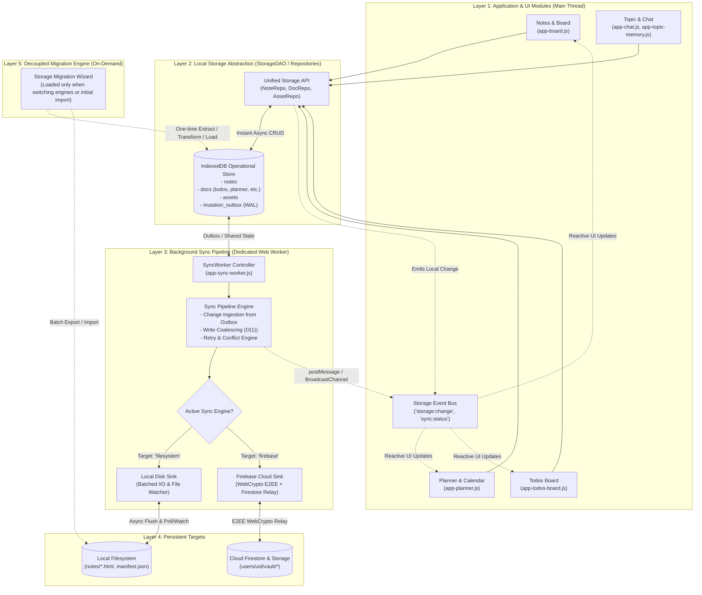

# Secretary: Storage & Synchronization Architecture Plan

## 1. Executive Summary

This document establishes the architecture plan for cleanly separating the storage and synchronization layers in Secretary. 

Under this model:
1. **The Application Layer (UI)** communicates exclusively with **IndexedDB** through strictly typed DAO/Repository helpers. No application components perform direct writes to IndexedDB, the filesystem, or cloud relays.
2. **The Local Operational Data Store (IndexedDB)** serves as the high-performance, single source of truth for all runtime operations (sub-millisecond reads/writes, zero UI thread blocking).
3. **The Synchronization Pipeline** runs completely on a **separate thread (Web Worker)**. It monitors a mutation outbox/journal in IndexedDB and synchronizes state with either:
   - **Target A: Local Disk (Filesystem)** (writing `.html` notes, `manifest.json`, `planner.json`), or
   - **Target B: Firebase Cloud Relay** (client-side AES-256-GCM encrypted zero-knowledge vault).
4. **Events and Reactive Communication** notify UI modules across threads via an event bus (`storage:change`, `sync:status`, `sync:conflict`), replacing legacy hardcoded view refreshes.
5. **Migration Logic** is decoupled into an on-demand module (`js/storage-migration.js`), isolating one-time conversion and export logic from standard daily application execution.

---

## 2. Target 5-Tier Architecture

---

## 3. Storage Layer Specifications

### Layer 1: Application & UI Modules (Main Thread)
- **Zero Direct I/O**: Application modules never invoke `readFile()`, `writeFile()`, `indexedDB.open()`, or network sync endpoints.
- **Semantic Repositories**: All interactions take place through high-level async methods:
  - `StorageAPI.notes.get(id)`
  - `StorageAPI.notes.save(noteData)`
  - `StorageAPI.notes.delete(id)`
  - `StorageAPI.docs.get(kind, docId)`
  - `StorageAPI.docs.save(kind, docId, data)`
  - `StorageAPI.assets.save(assetId, blobOrDataUrl)`
- **Optimistic Responsiveness**: Read and write operations resolve immediately against IndexedDB, keeping the main thread free of disk or network latency.

### Layer 2: IndexedDB Local Operational Data Store
- Standardized database name: `SecretaryLocalDB` (schema v5+).
- **Core Stores**:
  - `notes`: Plaintext/unlocked note entities (`id`, `title`, `contentHtml`, `tags`, `workstream`, `date`, `updatedAt`, `deleted`).
  - `docs`: Standardized key-value document store (`planner`, `todos/manifest`, `colleagues`, `settings`, `chat`).
  - `assets`: Blobs and media attachments.
  - `outbox` (WAL): Mutation journal `{ id, store, entityId, op: 'put'|'delete', revId, timestamp, status: 'pending'|'in-flight'|'synced' }`.
- **Validation & Isolation**: Repository helpers enforce sanitization and schema compatibility. Direct, unmediated access to IndexedDB object stores is disallowed.

### Layer 3: Background Sync Pipeline (Web Worker)
- Runs on a dedicated Web Worker thread (`js/app-sync-worker.js`).
- **Pipeline Stages**:
  1. **Change Ingestion**: Reads queued records from `outbox` either automatically on a tick or upon receiving a lightweight worker postMessage trigger.
  2. **Write Coalescing ($O(1)$)**: Rapid, repeated edits to the same document or note coalesce in an outbox map to suppress duplicate I/O operations.
  3. **Target Adapter Execution**:
     - **Filesystem Sink Driver**: Converts documents to disk files (`notes/${id}.html`, `notes/manifest.json`, `planner.json`, `todos/manifest.json`) and streams them to disk via background file operations or Worker IPC.
     - **Firebase Sink Driver**: Offloads PBKDF2 (100,000 iterations) and AES-256-GCM encryption off the main thread, batching updates to Cloud Firestore and Firebase Storage.
  4. **Inbound Remote Synchronization**: External changes (cloud snapshots or disk file modification timestamps) are written by the worker into IndexedDB, triggering an update event.

### Layer 4: Storage & Sync Event Bus
- Bridges background synchronization updates with the UI using `BroadcastChannel` or `Worker.postMessage` + `CustomEvent`:
  - `storage:entity-changed`: `{ entity: 'notes'|'planner'|'todos'|'docs', id: string, action: 'save'|'delete', origin: 'local'|'remote' }`
  - `sync:status`: `{ engine: 'filesystem'|'firebase', status: 'idle'|'syncing'|'offline'|'error', pendingCount: number }`
  - `sync:conflict`: `{ entity: string, id: string, local: object, remote: object, resolved: boolean }`
- Replaces legacy hardcoded UI refresh calls (such as `window.renderBoard()`) with loose coupling.

### Layer 5: Decoupled Migration Subsystem
- Located in `js/storage-migration.js`.
- **Loaded On-Demand**: Never loaded or initialized during normal application boot or standard user workflows.
- Loaded only when:
  - Initial setup / onboarding imports an existing filesystem directory into IndexedDB.
  - The user switches storage engines in Settings (Filesystem ⇄ Firebase).
  - Explicit backup or export operations are requested.
- Preserves clean boundaries and minimizes memory overhead during daily use.

---

## 4. Current State Review & Gap Analysis

| Architectural Requirement | Current Implementation | Gap / Violation |
|---|---|---|
| **IndexedDB as Universal Operational Store** | In `filesystem` mode, the app reads and writes directly to disk via `app-fs.js`. IndexedDB is only active in `firebase` mode. | **Critical Violation**: The UI thread performs direct disk I/O; no local database exists for filesystem mode. |
| **No Direct Storage Writes from Modules** | Several modules bypass `StorageAPI` and call `readFile`/`writeFile` directly:  • `js/app-topic-memory.js` (lines 79, 135, 220, 332, 1035, 1088) • `js/app-overlay.js` (lines 340, 5614, 5843) • `js/app-llm.js` (lines 499, 7767, 7808) | **Direct Write Violation**: Modules bypass caching, repositories, and sync tracking. |
| **Separate Thread / Web Worker Execution** | `js/app-sync-worker.js` exists as a prototype, but `new Worker` is never called in `app.html` or `app-firebase-sync.js`. Crypto and cloud sync execute synchronously on the main thread. | **Critical Performance Risk**: Main UI thread handles 100,000 PBKDF2 iterations and AES-GCM operations, causing frame drops. |
| **Worker & IndexedDB Interface Parity** | `js/app-sync-worker.js` calls methods like `idb.saveNote()`, `idb.getAllDocs()`, while `VaultIDBStorage` in `app-firebase-sync.js` defines `putNote()`, `getAllRecords('docs')`. | **Contract Mismatch**: Spawning the current worker prototype would throw runtime `TypeError` exceptions. |
| **Filesystem Sync Pipeline** | Only Firebase mode has a partial synchronization pipeline. There is no background pipeline for local disk writes. | **Missing Pipeline**: No background pipeline exists to debounce and flush IndexedDB changes to disk. |
| **Decoupled Event System** | Remote sync updates hardcode UI function calls like `window.renderBoard()` (`app-firebase-sync.js` lines 1234–1236). | **Tight Coupling**: Modules rely on hardcoded global function calls instead of an event bus. |
| **Decoupled Migration Logic** | ~1,300 lines of migration code are bundled directly inside `js/app-storage.js` (lines 1050–2314). | **Architectural Bloat**: Migration code is loaded on every application boot. |

---

## 5. Phased Implementation Roadmap

### Phase 1: Pure IndexedDB Layer & Repository Consolidation
- Standardize `SecretaryLocalDB` with stores for `notes`, `docs`, `assets`, and `outbox`.
- Expand `StorageAPI` with strict DAO repository helpers (`notes`, `docs`, `assets`).
- Migrate direct calls in `app-topic-memory.js`, `app-overlay.js`, and `app-llm.js` to `StorageAPI`.
- Verify unit tests across all entities.

### Phase 2: Migration Logic Decoupling
- Extract migration utilities from `js/app-storage.js` into `js/storage-migration.js`.
- Remove `migrateToFirebase()`, `revertToFilesystem()`, and backup routines from `app-storage.js`.
- Provide an on-demand dynamic loader in settings/onboarding for `storage-migration.js`.

### Phase 3: Background Worker Pipeline Activation
- Harmonize the API contract between `app-sync-worker.js` and `SecretaryLocalDB`.
- Instantiate and supervise the Web Worker in `StorageAPI` / `FirebaseSyncService`.
- Move PBKDF2 and AES-256-GCM operations into the Web Worker.
- Implement the Filesystem Sink Driver in the worker to stream debounced updates to disk asynchronously.

### Phase 4: Event-Driven UI Architecture
- Implement a unified Storage Event Bus (`storage:entity-changed`, `sync:status`, `sync:conflict`).
- Replace hardcoded calls like `window.renderBoard()` with event listeners in `app-board.js`, `app-planner.js`, and `app-todos-board.js`.
- Add integration tests verifying end-to-end multi-entity synchronization and worker pipelines.
